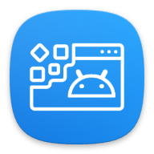

<div align="center">



# DroidPage

**A client-side landing page builder for mobile apps — design, preview, and export in your browser.**

No backend. No build step. No sign-up. Pick a theme, fill a form, download a ready-to-host static site.

[Features](#features) · [Quick Start](#quick-start) · [Themes](#themes) · [Project Structure](#project-structure) · [Adding a Theme](#adding-a-theme)


</div>

---

## Features

- **Live preview** — every edit reflects instantly in a sandboxed iframe, with smart fast-paths for color and text changes.
- **5 themes** — from minimal editorial to Apple-style liquid glass, all swappable in one click.
- **Form-based editing** — no code; fill in app name, tagline, features, screenshots, links, and SEO meta.
- **Full color & font control** — 8 themeable color variables plus font selection per page.
- **Image support** — drop in your app icon and screenshots.
- **Static export** — download a self-contained ZIP (HTML + CSS + JS) ready to host anywhere.
- **Persistence** — autosave to `localStorage`, plus JSON import/export to move projects between machines.
- **Undo / redo** — full edit history while you build.
- **Responsive editor** — desktop split-view collapses to a mobile drawer.

## Quick Start

DroidPage is a static site — serve the project root with any HTTP server.

```bash
# clone
git clone https://github.com/OneDroid/DroidPage.git
cd DroidPage

# serve (any of these)
python3 -m http.server 8766
# or:  npx serve .
# or:  php -S localhost:8766
```

Open <http://localhost:8766> and start building.

> ES6 modules require an HTTP origin — opening `index.html` directly via `file://` will not load the JS.

### Workflow

1. **Home** (`index.html`) — browse the theme gallery.
2. Click **Live Demo** to preview a theme, or **Edit** to open it in the builder.
3. **Editor** (`editor.html`) — pick a theme, fill in your content, tune colors, fonts, header, and footer.
4. Upload your icon and screenshots.
5. **Download Website** — exports a ready-to-host ZIP.

## Themes

| Theme | ID | Style |
|-------|----|----|
| DroidPage Default | `droidpage-default` | Clean light, modern product page |
| Dark Glass | `droidpage-glass` | Dark glassmorphism, frosted panels, neon accent glow |
| Minimal Editorial | `droidpage-editorial` | Serif magazine layout, generous whitespace, ruled sections |
| Playful Gradient | `droidpage-playful` | Vibrant gradients, chunky rounded cards, bouncy hover |
| Vision Glass | `droidpage-vision` | Apple-style liquid glass over a soft color-mesh backdrop |

## Pages

| File | Purpose |
|------|---------|
| `index.html` | Home — navbar, hero, theme gallery |
| `editor.html` | The builder. Accepts `?theme=<id>` to preselect a theme |
| `demo.html` | Standalone live preview. Accepts `?theme=<id>`, renders with demo content |

## Project Structure

```
DroidPage/
├── index.html              # home / theme gallery
├── editor.html             # builder UI
├── demo.html               # standalone theme preview
├── assets/
│   ├── css/
│   │   ├── global.css       # shared base, consumed by templates
│   │   ├── home.css         # home page
│   │   └── editor.css       # builder UI
│   ├── js/
│   │   ├── pages/           # page entry points
│   │   │   ├── home.js
│   │   │   ├── editor.js
│   │   │   └── demo.js
│   │   ├── modules/         # shared ES6 modules
│   │   │   ├── renderer.js   # {{placeholder}} → HTML
│   │   │   ├── preview.js    # live iframe rendering
│   │   │   ├── exporter.js   # ZIP export
│   │   │   ├── formManager.js
│   │   │   ├── themeManager.js
│   │   │   └── icons.js
│   │   └── vendor/          # third-party libs (FileSaver)
│   └── img/
├── config/
│   └── themes.json          # theme registry + color variables
└── templates/
    └── <theme-id>/
        ├── index.html       # {{placeholder}} markup (identical across themes)
        └── public/
            ├── styles/theme.css
            ├── scripts/theme.js
            └── media/        # logo + screenshots
```

## How It Works

- **Templates** are plain HTML with `{{placeholder}}` tokens. `renderer.js` substitutes form data to produce the final markup.
- **Shared contract** — every theme uses *identical* placeholders and element IDs, so the renderer, live preview, and editor code work against any theme unchanged. Themes differ only in `theme.css`.
- **Color bridge** — `themes.json` defines 8 color variables per theme (`primary_color`, `bg_color`, `text_primary`, `text_secondary`, `card_bg`, `border_color`, `header_bg`, `footer_bg`); each `theme.css` maps them to its own CSS custom properties.
- **Export** — `exporter.js` rewrites asset paths to a flat layout and bundles `index.html` + styles + scripts into a ZIP via JSZip + FileSaver.

## Adding a Theme

1. Copy an existing folder, e.g. `templates/droidpage-default/` → `templates/droidpage-yourtheme/`.
2. Keep `index.html` and `public/scripts/theme.js` **unchanged** (the shared contract). Restyle only `public/styles/theme.css`.
3. Map the 8 color variables to your theme's CSS custom properties inside `:root`.
4. Register the theme in `config/themes.json` with `id`, `name`, `description`, `thumbnail`, `path`, and a `colorVars` block of 8 entries.
5. Reload — your theme appears in the gallery and editor automatically.

## Technology Stack

- HTML5 / CSS3 (vanilla, no framework)
- ES6 modules
- [JSZip](https://stuk.github.io/jszip/) — ZIP generation
- [FileSaver.js](https://github.com/eligrey/FileSaver.js/) — client-side download

## Deployment

Fully static — host the project root on GitHub Pages, Netlify, Vercel, Cloudflare Pages, or any static host. Exported landing pages are likewise standalone and host anywhere.

## License

MIT © OneDroid
